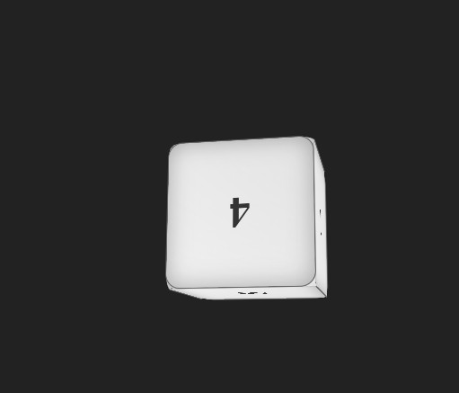

# 3D Dice Roller

Aplicación web interactiva que simula un dado de 6 caras en 3D utilizando tecnologías web estándar.

## Características
- Visualización 3D realista del dado
- Animación suave al lanzar
- Interactividad mediante click/tap
- Diseño responsive
- Sombras y gradientes para efecto tridimensional
- Compatibilidad con navegadores modernos
